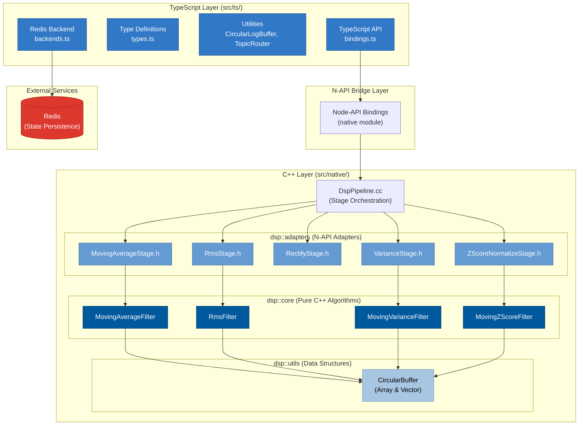

# Work in Progress

# dsp-ts-redis

> **High-performance digital signal processing for TypeScript with native C++ acceleration and Redis state persistence**

A modern DSP library built for Node.js backends processing real-time biosignals, audio streams, and sensor data. Features native C++ filters with full state serialization to Redis, enabling seamless processing across service restarts and distributed workers.

[](https://www.npmjs.com/package/dsp-ts-redis)
[](https://github.com/yourusername/dsp-ts-redis/actions)
[](https://opensource.org/licenses/MIT)

---

## ✨ Features

- 🚀 **Native C++ Performance** – Optimized circular buffers and filters for real-time processing
- 🔧 **TypeScript-First** – Full type safety with excellent IntelliSense
- 📡 **Redis State Persistence** – Fully implemented state serialization/deserialization including circular buffer contents and running sums
- 🔗 **Fluent Pipeline API** – Chain filter operations with method chaining
- 🎯 **Zero-Copy Processing** – Direct TypedArray manipulation for minimal overhead
- 📊 **Multi-Channel Support** – Process multi-channel signals (EMG, EEG, audio) with independent filter states per channel
- ⚡ **Async Processing** – Background thread processing to avoid blocking the Node.js event loop
- 🛡️ **Crash Recovery** – Resume processing from exact state after service restarts

---

## 🏗️ Architecture

The library uses a layered architecture with clear separation between TypeScript and C++ components:



### Key Architectural Principles

**1. Namespace Separation**

- **`dsp::core`**: Pure C++ algorithms with no Node.js dependencies. Reusable in other C++ projects.
- **`dsp::adapters`**: N-API wrapper classes that expose core algorithms to JavaScript.
- **`dsp::utils`**: Shared data structures (circular buffers) used by core algorithms.

**2. Layered Design**

- **TypeScript Layer**: User-facing API, type safety, Redis integration
- **N-API Bridge**: Zero-copy data marshaling between JS and C++
- **C++ Core**: High-performance DSP algorithms with optimized memory management

**3. State Management**

- Each filter maintains internal state (circular buffers, running sums)
- Full state serialization to JSON for Redis persistence
- State validation on deserialization ensures data integrity

**4. Mode Architecture** (MovingAverage, RMS, Variance, ZScoreNormalize)

- **Batch Mode**: Stateless processing, computes over entire input
- **Moving Mode**: Stateful processing with sliding window continuity

This separation enables:

- ✅ Unit testing of C++ algorithms independently
- ✅ Reuse of core DSP code in other projects
- ✅ Type-safe TypeScript API with IntelliSense
- ✅ Zero-copy performance through N-API
- ✅ Distributed processing with Redis state sharing

---

## 📦 Installation

```bash
npm install dsp-ts-redis redis
```

**Note:** You'll need a C++ compiler if prebuilt binaries aren't available for your platform:

- Windows: Visual Studio 2022 or Build Tools
- macOS: Xcode Command Line Tools
- Linux: GCC/G++ 7+

---

## 🚀 Quick Start

### Basic Usage

```typescript
import { createDspPipeline } from "dsp-ts-redis";

// Create a processing pipeline
const pipeline = createDspPipeline();

// Add filters using method chaining
pipeline.MovingAverage({ windowSize: 100 });

// Process samples (modifies input in-place for performance)
const input = new Float32Array([1, 2, 3, 4, 5, 6, 7, 8, 9, 10]);
const output = await pipeline.process(input, {
  sampleRate: 2000,
  channels: 1,
});

console.log(output); // Smoothed signal
```

### Processing Without Modifying Input

```typescript
// Use processCopy to preserve the original input
const input = new Float32Array([1, 2, 3, 4, 5]);
const output = await pipeline.processCopy(input, {
  sampleRate: 2000,
  channels: 1,
});

console.log(input); // [1, 2, 3, 4, 5] - unchanged
console.log(output); // [1, 1.5, 2, 3, 4] - smoothed
```

### With Redis State Persistence

```typescript
import { createDspPipeline } from "dsp-ts-redis";
import { createClient } from "redis";

const redis = await createClient({ url: "redis://localhost:6379" }).connect();

// Create pipeline with Redis config
const pipeline = createDspPipeline({
  redisHost: "localhost",
  redisPort: 6379,
  stateKey: "dsp:user123:channel1",
});

pipeline.MovingAverage({ windowSize: 100 });

// Try to restore previous state from Redis
const savedState = await redis.get("dsp:user123:channel1");
if (savedState) {
  await pipeline.loadState(savedState);
  console.log("State restored!");
}

// Process data - filter state is maintained
await pipeline.process(chunk1, { sampleRate: 2000, channels: 1 });

// Save state to Redis (includes circular buffer contents!)
const state = await pipeline.saveState();
await redis.set("dsp:user123:channel1", state);

// Continue processing - even after service restart!
await pipeline.process(chunk2, { sampleRate: 2000, channels: 1 });

// Clear state when starting fresh
pipeline.clearState();
```

### Multi-Channel Processing

```typescript
import { createDspPipeline } from "dsp-ts-redis";

const pipeline = createDspPipeline();
pipeline.MovingAverage({ windowSize: 50 });

// Process 4-channel EMG data
// Data format: [ch1_s1, ch2_s1, ch3_s1, ch4_s1, ch1_s2, ch2_s2, ...]
const fourChannelData = new Float32Array(4000); // 1000 samples × 4 channels

const output = await pipeline.process(fourChannelData, {
  sampleRate: 2000,
  channels: 4, // Each channel maintains its own filter state
});

// Each channel is processed independently with its own circular buffer
```

---

## 🔗 API Reference

### Creating a Pipeline

```typescript
import { createDspPipeline, type RedisConfig } from "dsp-ts-redis";

interface RedisConfig {
  redisHost?: string;   // Redis server hostname (optional)
  redisPort?: number;   // Redis server port (optional)
  stateKey?: string;    // Key prefix for state storage (optional)
}

const pipeline = createDspPipeline(config?: RedisConfig);
```

### Process Options

```typescript
interface ProcessOptions {
  sampleRate: number;   // Sample rate in Hz (required)
  channels?: number;    // Number of channels (default: 1)
}

await pipeline.process(input: Float32Array, options: ProcessOptions);
```

### Available Filters

#### Currently Implemented

##### Moving Average Filter

```typescript
// Batch Mode - Stateless, computes average over entire input
pipeline.MovingAverage({ mode: "batch" });

// Moving Mode - Stateful, sliding window with continuity
pipeline.MovingAverage({ mode: "moving", windowSize: number });
```

Implements a simple moving average (SMA) filter with two modes:

**Modes:**

| Mode       | Description                        | State     | Output                                      | Use Case                            |
| ---------- | ---------------------------------- | --------- | ------------------------------------------- | ----------------------------------- |
| `"batch"`  | Computes average over entire input | Stateless | All samples have same value (mean of input) | Quality metrics, summary statistics |
| `"moving"` | Sliding window across samples      | Stateful  | Each sample smoothed by window              | Real-time smoothing, trend analysis |

**Parameters:**

- `mode`: `"batch"` or `"moving"` - determines computation strategy
- `windowSize`: Number of samples to average over **(required for moving mode only)**

**Features:**

- **Batch mode**: O(n) computation, no state between calls
- **Moving mode**: O(1) per sample with circular buffer and running sum
- Per-channel state for multi-channel processing
- Full state serialization to Redis

**Example:**

```typescript
// Batch mode: Average of [1,2,3,4,5] = 3
const batch = createDspPipeline().MovingAverage({ mode: "batch" });
const result1 = await batch.process(new Float32Array([1, 2, 3, 4, 5]));
// result1 = [3, 3, 3, 3, 3]

// Moving mode: Window size 3
const moving = createDspPipeline().MovingAverage({
  mode: "moving",
  windowSize: 3,
});
const result2 = await moving.process(new Float32Array([1, 2, 3, 4, 5]));
// result2 = [1, 1.5, 2, 3, 4] (sliding window averages)
```

**Use cases:**

- **Batch**: Quality control metrics, batch statistics, data summarization
- **Moving**: Signal smoothing, noise reduction, trend analysis, low-pass filtering

##### RMS (Root Mean Square) Filter

```typescript
// Batch Mode - Stateless, computes RMS over entire input
pipeline.Rms({ mode: "batch" });

// Moving Mode - Stateful, sliding window with continuity
pipeline.Rms({ mode: "moving", windowSize: number });
```

Implements an efficient RMS filter with two modes:

**Modes:**

| Mode       | Description                    | State     | Output                                     | Use Case                            |
| ---------- | ------------------------------ | --------- | ------------------------------------------ | ----------------------------------- |
| `"batch"`  | Computes RMS over entire input | Stateless | All samples have same value (RMS of input) | Power measurement, batch analysis   |
| `"moving"` | Sliding window across samples  | Stateful  | Each sample is RMS of window               | Envelope detection, real-time power |

**Parameters:**

- `mode`: `"batch"` or `"moving"` - determines computation strategy
- `windowSize`: Number of samples to calculate RMS over **(required for moving mode only)**

**Features:**

- **Batch mode**: O(n) computation, no state between calls
- **Moving mode**: O(1) per sample with circular buffer and running sum of squares
- Per-channel state for multi-channel processing
- Full state serialization to Redis
- Always positive output (magnitude-based)

**Example:**

```typescript
// Batch mode: RMS of [1, -2, 3, -4, 5] = sqrt((1² + 4 + 9 + 16 + 25)/5) = 3.31
const batch = createDspPipeline().Rms({ mode: "batch" });
const result1 = await batch.process(new Float32Array([1, -2, 3, -4, 5]));
// result1 = [3.31, 3.31, 3.31, 3.31, 3.31]

// Moving mode: Window size 3
const moving = createDspPipeline().Rms({ mode: "moving", windowSize: 3 });
const result2 = await moving.process(new Float32Array([1, -2, 3, -4, 5]));
// result2 = [1.0, 1.58, 2.16, 3.11, 4.08] - sliding window RMS
```

**Use cases:**

- **Batch**: Overall signal power, quality metrics, batch statistics
- **Moving**: Signal envelope detection, amplitude tracking, power measurement, feature extraction

##### Rectify Filter

```typescript
pipeline.Rectify(params?: { mode?: "full" | "half" });
```

Implements signal rectification with two modes: full-wave (absolute value) and half-wave (zero out negatives). Stateless operation with no internal buffers.

**Parameters:**

- `mode` (optional): Rectification mode
  - `"full"` (default): Full-wave rectification (absolute value) - converts all samples to positive
  - `"half"`: Half-wave rectification - positive samples unchanged, negative samples → 0

**Features:**

- Zero overhead - simple sample-by-sample transformation
- No internal state/buffers (stateless)
- Mode is serializable for pipeline persistence
- Works independently on each sample (no windowing)

**Use cases:**

- EMG signal pre-processing before envelope detection
- AC to DC conversion in audio/biosignal processing
- Preparing signals for RMS or moving average smoothing
- Feature extraction requiring positive-only values

**Examples:**

```typescript
// Full-wave rectification (default) - converts to absolute value
const pipeline1 = createDspPipeline();
pipeline1.Rectify(); // or Rectify({ mode: "full" })

const bipolar = new Float32Array([1, -2, 3, -4, 5]);
const fullWave = await pipeline1.process(bipolar, {
  sampleRate: 1000,
  channels: 1,
});
console.log(fullWave); // [1, 2, 3, 4, 5] - all positive

// Half-wave rectification - zeros out negatives
const pipeline2 = createDspPipeline();
pipeline2.Rectify({ mode: "half" });

const halfWave = await pipeline2.process(new Float32Array([1, -2, 3, -4, 5]), {
  sampleRate: 1000,
  channels: 1,
});
console.log(halfWave); // [1, 0, 3, 0, 5] - negatives become zero

// Common pipeline: Rectify → RMS for EMG envelope
const emgPipeline = createDspPipeline();
emgPipeline
  .Rectify({ mode: "full" }) // Convert to magnitude
  .Rms({ windowSize: 50 }); // Calculate envelope
```

##### Variance Filter

```typescript
pipeline.Variance(params: { mode: "batch" | "moving"; windowSize?: number });
```

Implements variance calculation to measure data spread and variability. Supports both stateless batch variance and stateful moving variance with a sliding window.

**Parameters:**

- `mode`: Variance calculation mode
  - `"batch"`: Stateless - computes variance over entire batch, all output samples contain the same value
  - `"moving"`: Stateful - computes variance over a sliding window, maintains state across process() calls
- `windowSize`: Required for `"moving"` mode - size of the sliding window

**Features:**

- **Batch mode**: O(1) space complexity, processes entire batch in two passes
- **Moving mode**: O(1) per-sample computation using circular buffer with running sums
- Maintains running sum and running sum of squares for efficient calculation
- Per-channel state for multi-channel processing
- Full state serialization to Redis including buffer contents and running values
- Variance is always non-negative (uses max(0, calculated) to handle floating-point errors)

**Mathematical Note:**

Variance is calculated as: `Var(X) = E[X²] - (E[X])²`

Where:

- `E[X]` is the mean (average) of values
- `E[X²]` is the mean of squared values

**Use cases:**

- Signal quality monitoring (detect signal stability)
- Anomaly detection (identify unusual variability)
- Feature extraction for machine learning (EMG, EEG analysis)
- Real-time variability tracking in biosignals
- Data consistency validation in sensor streams

**Examples:**

```typescript
// Batch variance - stateless, entire batch → single variance value
const pipeline1 = createDspPipeline();
pipeline1.Variance({ mode: "batch" });

const data = new Float32Array([1, 2, 3, 4, 5]);
const output1 = await pipeline1.process(data, {
  sampleRate: 1000,
  channels: 1,
});
console.log(output1); // [2, 2, 2, 2, 2] - all values are the batch variance

// Moving variance - stateful, sliding window
const pipeline2 = createDspPipeline();
pipeline2.Variance({ mode: "moving", windowSize: 3 });

const output2 = await pipeline2.process(data, {
  sampleRate: 1000,
  channels: 1,
});
console.log(output2);
// [0, 0.25, 0.67, 0.67, 0.67] - variance evolves as window slides
// Window: [1] → [1,2] → [1,2,3] → [2,3,4] → [3,4,5]

// EMG variability monitoring pipeline
const emgPipeline = createDspPipeline()
  .Rectify({ mode: "full" }) // Convert to magnitude
  .Variance({ mode: "moving", windowSize: 100 }); // Track variability

// Multi-channel signal quality monitoring
const qualityPipeline = createDspPipeline().Variance({ mode: "batch" });

const fourChannelData = new Float32Array(4000); // 1000 samples × 4 channels
const variances = await qualityPipeline.process(fourChannelData, {
  sampleRate: 2000,
  channels: 4,
});
// Each channel gets its own variance value
```

**Batch vs Moving Mode:**

| Mode     | State     | Output                        | Use Case                       |
| -------- | --------- | ----------------------------- | ------------------------------ |
| `batch`  | Stateless | All samples = single variance | Per-chunk quality assessment   |
| `moving` | Stateful  | Variance per sample (sliding) | Real-time variability tracking |

**Performance:**

- Batch mode: Two-pass algorithm (sum calculation, then variance), O(n) time
- Moving mode: Single-pass with circular buffer, O(1) per sample after warmup
- State persistence includes full circular buffer + running sums (can be large for big windows)

##### Z-Score Normalization Filter

```typescript
pipeline.ZScoreNormalize(params: {
  mode: "batch" | "moving";
  windowSize?: number;
  epsilon?: number;
});
```

Implements Z-Score normalization to standardize data to have mean 0 and standard deviation 1. Supports both stateless batch normalization and stateful moving normalization with a sliding window.

**Z-Score Formula:** `(Value - Mean) / StandardDeviation`

**Parameters:**

- `mode`: Normalization calculation mode
  - `"batch"`: Stateless - computes mean and stddev over entire batch, normalizes all samples
  - `"moving"`: Stateful - computes mean and stddev over sliding window, maintains state across process() calls
- `windowSize`: Required for `"moving"` mode - size of the sliding window
- `epsilon`: Small value to prevent division by zero when standard deviation is 0 (default: `1e-6`)

**Features:**

- **Batch mode**: Normalizes entire dataset to mean=0, stddev=1 using global statistics
- **Moving mode**: Adaptive normalization using local window statistics
- Maintains running sum and running sum of squares for O(1) mean/stddev calculation
- Per-channel state for multi-channel processing
- Full state serialization including buffer contents and running values
- Epsilon handling prevents NaN when processing constant signals

**Use cases:**

- Machine learning preprocessing (feature standardization)
- Anomaly detection (outlier identification using ±3σ thresholds)
- Neural network input normalization
- EEG/EMG signal standardization for multi-channel processing
- Real-time data stream normalization with adaptive statistics
- Removing baseline drift and amplitude variations

**Examples:**

```typescript
// Batch normalization - standardize entire dataset
const pipeline1 = createDspPipeline();
pipeline1.ZScoreNormalize({ mode: "batch" });

const data = new Float32Array([10, 20, 30, 40, 50]);
const output1 = await pipeline1.process(data, {
  sampleRate: 1000,
  channels: 1,
});
// All samples normalized to mean=0, stddev=1
// Output: [-1.414, -0.707, 0, 0.707, 1.414] (approximately)

// Moving normalization - adaptive standardization
const pipeline2 = createDspPipeline();
pipeline2.ZScoreNormalize({ mode: "moving", windowSize: 50 });

const streamData = new Float32Array(200); // Continuous stream
const output2 = await pipeline2.process(streamData, {
  sampleRate: 1000,
  channels: 1,
});
// Each sample normalized using local window statistics
// Adapts to changes in mean and variance over time

// Anomaly detection with z-score thresholds
const pipeline3 = createDspPipeline();
pipeline3.ZScoreNormalize({ mode: "moving", windowSize: 100 });

const sensorData = new Float32Array(500);
const zScores = await pipeline3.process(sensorData, {
  sampleRate: 100,
  channels: 1,
});

// Detect outliers (z-score > ±3 indicates anomaly)
const anomalies = [];
for (let i = 0; i < zScores.length; i++) {
  if (Math.abs(zScores[i]) > 3.0) {
    anomalies.push({ index: i, zScore: zScores[i] });
  }
}

// Multi-channel EEG normalization
const eegPipeline = createDspPipeline();
eegPipeline.ZScoreNormalize({ mode: "moving", windowSize: 128 });

const fourChannelEEG = new Float32Array(2048); // 512 samples × 4 channels
const normalizedEEG = await eegPipeline.process(fourChannelEEG, {
  sampleRate: 256,
  channels: 4,
});
// Each EEG channel independently normalized to mean=0, stddev=1

// Custom epsilon for near-constant signals
const pipeline4 = createDspPipeline();
pipeline4.ZScoreNormalize({ mode: "batch", epsilon: 0.1 });

const nearConstant = new Float32Array([5.0, 5.001, 4.999, 5.0]);
const output4 = await pipeline4.process(nearConstant, {
  sampleRate: 1000,
  channels: 1,
});
// When stddev < epsilon, output is 0 (prevents division by tiny numbers)
```

**Batch vs Moving Mode:**

| Mode     | State     | Output                                          | Use Case                                            |
| -------- | --------- | ----------------------------------------------- | --------------------------------------------------- |
| `batch`  | Stateless | All samples normalized using global mean/stddev | ML preprocessing, dataset standardization           |
| `moving` | Stateful  | Each sample normalized using local window stats | Real-time anomaly detection, adaptive normalization |

**Performance:**

- Batch mode: Two-pass algorithm (calculate mean, then stddev, then normalize), O(n) time
- Moving mode: Single-pass with circular buffer, O(1) per sample after warmup
- Anomaly detection: O(1) threshold comparison after normalization
- State persistence includes full circular buffer + running sums

**Mathematical Properties:**

- Normalized data has mean = 0 (centered)
- Normalized data has standard deviation = 1 (scaled)
- Z-scores > ±3 represent outliers (>99.7% of data within ±3σ in normal distribution)
- Preserves relative distances and relationships in the data
- Linear transformation (reversible if original mean/stddev are known)

#### 🚧 Coming Soon

The following filters are planned for future releases:

- **IIR/FIR Filters**: Butterworth, Chebyshev, notch filters
- **Transform Domain**: FFT, STFT, Hilbert transform
- **EMG/Biosignal**: Specialized EMG processing stages
- **Feature Extraction**: Zero-crossing rate, peak detection

See the [project roadmap](./ROADMAP.md) for more details.

---

### Pipeline Callbacks (Monitoring & Observability)

Configure callbacks for monitoring, alerting, and observability. The library supports both **individual** and **pooled/batched** callbacks:

#### Basic Usage

```typescript
import { createDspPipeline } from "dsp-ts-redis";
import type { PipelineCallbacks } from "dsp-ts-redis";

const callbacks: PipelineCallbacks = {
  // Monitor individual samples (use sparingly - can impact performance)
  onSample: (value, index, stage) => {
    if (value > THRESHOLD) {
      triggerAlert(index, stage);
    }
  },

  // Track performance metrics
  onStageComplete: (stage, durationMs) => {
    metrics.record(`dsp.${stage}.duration`, durationMs);
  },

  // Handle errors gracefully
  onError: (stage, error) => {
    logger.error(`Stage ${stage} failed`, error);
  },

  // Structured logging (called immediately for each log)
  onLog: (level, msg, context) => {
    if (level === "debug") return; // Filter debug logs
    console.log(`[${level}] ${msg}`, context);
  },
};

// Configure callbacks before adding filters
const pipeline = createDspPipeline()
  .pipeline(callbacks)
  .MovingAverage({ windowSize: 10 })
  .Rectify()
  .Rms({ windowSize: 5 });
```

#### Pooled/Batched Callbacks (Better Performance)

For high-throughput scenarios, use **pooled callbacks** to reduce overhead:

```typescript
const callbacks: PipelineCallbacks = {
  // Process samples in batches (more efficient than onSample)
  onBatch: (batch) => {
    console.log(`Stage: ${batch.stage}`);
    console.log(`Samples: ${batch.count}`);

    // Process entire batch efficiently (SIMD-friendly)
    for (let i = 0; i < batch.samples.length; i++) {
      if (batch.samples[i] > THRESHOLD) {
        triggerAlert(batch.startIndex + i, batch.stage);
      }
    }
  },

  // Receive all logs at once (pooled during processing)
  onLogBatch: (logs) => {
    // Send all logs to external system in one request
    await loggingService.sendBatch(
      logs.map((log) => ({
        level: log.level,
        message: log.message,
        timestamp: log.timestamp,
        ...log.context,
      }))
    );
  },

  onStageComplete: (stage, durationMs) => {
    metrics.record(`dsp.${stage}.duration`, durationMs);
  },
};
```

**When to Use What:**

| Callback Type     | Best For                                                      | Throughput       | Production Safety                       |
| ----------------- | ------------------------------------------------------------- | ---------------- | --------------------------------------- |
| `onSample`        | Peak detection, threshold alerts, individual value monitoring | ~6M samples/sec  | ⚠️ **RISKY** - Blocks event loop        |
| `onBatch`         | Batch aggregation, efficient sample processing                | ~23M samples/sec | ✅ **SAFE** - Non-blocking              |
| `onLog`           | Real-time logging, immediate output                           | Variable         | ⚠️ **RISKY** - Synchronous I/O per call |
| `onLogBatch`      | External logging services, log aggregation                    | ~3M samples/sec  | ✅ **SAFE** - Batched, non-blocking     |
| `onStageComplete` | Performance metrics, timing                                   | ✅ Minimal       | ✅ **SAFE** - 1 call per process        |
| `onError`         | Error handling                                                | ✅ Minimal       | ✅ **SAFE** - Only on error             |

**Critical Performance & Safety Notes:**

- **🚨 Individual callbacks (`onSample`, `onLog`) are fast but dangerous**:

  - Higher raw throughput in microbenchmarks (~6M samples/sec)
  - **Block the Node.js event loop** with millions of synchronous function calls
  - Synchronous I/O operations in callbacks can stall entire pipeline
  - Unpredictable GC pressure from per-call allocations
  - **NOT recommended for production servers**

- **✅ Pooled callbacks (`onBatch`, `onLogBatch`) are production-safe**:

  - Stable, predictable throughput (~3M samples/sec sustained)
  - **Non-blocking**: Batched operations prevent event loop starvation
  - **Backpressure-friendly**: Aligns with real-world telemetry systems (Kafka, Loki, Prometheus)
  - Fixed memory footprint via circular buffer (no unbounded growth)
  - **Recommended for high-throughput production environments**

- **Architecture trade-off**:

  - Individual mode: 2x faster in synthetic benchmarks, but impractical for live servers
  - Pooled mode: Slight raw speed reduction, but guarantees non-blocking safety
  - **Industry standard**: Pooled/batched callbacks match production observability patterns (Kafka producers, OpenTelemetry exporters, Loki agents)

- **Circular buffer implementation**:
  - Fixed capacity: 32 log entries (typical: 2-3 logs per process call)
  - Zero reallocations after initialization
  - Cache-friendly memory access pattern
  - Graceful overflow: Overwrites oldest entries (prevents memory leaks)

See `src/ts/examples/callbacks/` for complete examples including performance comparisons.

---

### Topic-Based Logging (Kafka-Style Filtering)

Filter logs using **Kafka-style hierarchical topics** for efficient, selective subscription:

#### Topic Structure

```
pipeline.debug                         # General debug logs
pipeline.info                          # General info logs
pipeline.warn                          # General warnings
pipeline.error                         # General errors
pipeline.stage.<stageName>.<category>  # Stage-specific logs
  ├── samples                          # Sample-level data
  ├── performance                      # Timing/metrics
  └── error                            # Stage errors
```

#### Basic Topic Filtering

```typescript
const pipeline = createDspPipeline();

// Subscribe to ALL logs (no filter)
pipeline.pipeline({
  onLogBatch: (logs) => {
    logs.forEach((log) => {
      console.log(`[${log.topic}] ${log.level}: ${log.message}`);
      // [pipeline.debug] debug: Starting pipeline processing
      // [pipeline.stage.rms.performance] info: RMS processing complete
    });
  },
});

// Filter by stage (only RMS logs)
pipeline.pipeline({
  onLogBatch: (logs) => {
    logs.forEach((log) => console.log(log.message));
  },
  topicFilter: "pipeline.stage.rms.*", // Only RMS stage logs
});

// Filter by category (only errors)
pipeline.pipeline({
  onLogBatch: (logs) => {
    if (logs.length > 0) {
      alertService.notify("Pipeline errors detected", logs);
    }
  },
  topicFilter: "pipeline.*.error", // All errors from any stage
});

// Multiple filters (errors + performance)
pipeline.pipeline({
  onLogBatch: (logs) => {
    logs.forEach((log) => {
      if (log.topic.includes("error")) {
        errorAlerts.push(log);
      } else {
        metrics.push(log);
      }
    });
  },
  topicFilter: [
    "pipeline.*.error", // All errors
    "pipeline.*.performance", // All performance metrics
  ],
});
```

#### Topic-Based Routing (Production Pattern)

```typescript
const pipeline = createDspPipeline();

pipeline.pipeline({
  onLogBatch: (logs) => {
    // Route logs to different backends based on topic
    logs.forEach((log) => {
      if (log.topic.includes("error")) {
        // Send errors to alerting system (PagerDuty, Slack, etc.)
        await alerting.send(log);
      } else if (
        log.topic.includes("performance") ||
        log.topic.includes("samples")
      ) {
        // Send metrics to monitoring (Prometheus, Datadog, etc.)
        await metrics.record(log.topic, log.context);
      } else {
        // Send debug logs to centralized logging (Loki, Elasticsearch, etc.)
        await logging.send(log);
      }
    });
  },
});
```

**Topic Filter Patterns:**

| Pattern                                        | Matches                                   |
| ---------------------------------------------- | ----------------------------------------- |
| `pipeline.stage.*`                             | All logs from any stage                   |
| `pipeline.stage.rms.*`                         | Only RMS stage logs                       |
| `pipeline.*.error`                             | All errors (any stage)                    |
| `pipeline.*.performance`                       | All performance metrics                   |
| `['pipeline.error', 'pipeline.stage.*.error']` | Multiple patterns (errors from any stage) |

**Production Benefits:**

- ✅ **Selective subscription** - Filter at source, reduce processing overhead
- ✅ **Topic-based routing** - Different topics → different backends (Kafka, Loki, Prometheus)
- ✅ **Industry alignment** - Matches telemetry standards (Kafka topics, NATS subjects, MQTT topics)
- ✅ **Efficient filtering** - Wildcard patterns processed before callback invocation

See `src/ts/examples/callbacks/topic-based-logging.ts` for comprehensive examples.

---

### Topic Router (Fan-Out to Multiple Backends)

The `TopicRouter` provides **production-grade fan-out routing** to multiple observability backends, matching patterns used by Grafana Loki, OpenTelemetry, and FluentBit:

#### Builder Pattern (Recommended)

```typescript
import { createDspPipeline, createTopicRouter } from "dsp-ts-redis";

const router = createTopicRouter()
  // Critical errors → PagerDuty
  .errors(async (log) => {
    await pagerDuty.alert(log);
  })

  // Performance metrics → Prometheus
  .performance(async (log) => {
    await prometheus.record(log.topic, log.context);
  })

  // Debug logs → Loki
  .debug(async (log) => {
    await loki.send(log);
  })

  // Everything else → CloudWatch (backup)
  .default(async (log) => {
    await cloudwatch.send(log);
  })
  .build();

const pipeline = createDspPipeline();
pipeline
  .pipeline({
    onLogBatch: (logs) => router.routeBatch(logs),
  })
  .MovingAverage({ windowSize: 10 })
  .Rms({ windowSize: 5 });
```

#### Custom Route Patterns

```typescript
const router = createTopicRouter()
  .custom(/^pipeline\.error/, pagerDuty.alert, "error-alerts")
  .custom(/^pipeline\.stage\.rms/, prometheusHandler, "rms-metrics")
  .custom(/^pipeline\.performance/, prometheusHandler, "performance")
  .custom(/.*/, loki.send, "default-logs")
  .build();
```

#### Multi-Backend Fan-Out

```typescript
// Route errors to BOTH PagerDuty AND CloudWatch
const router = createTopicRouter()
  .errors(async (log) => {
    await Promise.all([
      pagerDuty.alert(log),
      cloudwatch.send(log), // Backup for audit
    ]);
  })
  .build();
```

#### Stage-Specific Routing

```typescript
const router = createTopicRouter()
  .stage("rms", async (log) => {
    // Only RMS stage logs
    await prometheus.record(log.topic, log.context);
  })
  .stage("movingAverage", async (log) => {
    // Only MovingAverage stage logs
    await loki.send(log);
  })
  .build();
```

**Router API:**

| Method           | Purpose                                        | Example                      |
| ---------------- | ---------------------------------------------- | ---------------------------- |
| `.errors()`      | Route errors to alerting (PagerDuty, Slack)    | Critical alerts              |
| `.performance()` | Route metrics to monitoring (Prometheus, DD)   | Timing, throughput           |
| `.debug()`       | Route debug logs to centralized logging (Loki) | Development traces           |
| `.alerts()`      | Route threshold crossings to alerting          | Anomaly detection            |
| `.stage(name)`   | Route stage-specific logs                      | Per-filter monitoring        |
| `.custom(regex)` | Route with custom pattern                      | Organization-specific topics |
| `.default()`     | Catch-all route (add last)                     | Backup logging               |

**Production Benefits:**

- ✅ **Parallel routing**: All backends called concurrently (`Promise.all`)
- ✅ **Non-blocking**: Async handlers prevent DSP throughput impact
- ✅ **Error isolation**: Failed backend doesn't break pipeline
- ✅ **Type-safe**: Full TypeScript support with RouteHandler type
- ✅ **Extensible**: Add routes without modifying pipeline code
- ✅ **Industry standard**: Matches Loki, OTEL, FluentBit, Vector.dev patterns

See `src/ts/examples/callbacks/production-topic-router.ts` for comprehensive examples.

---

### Priority-Based Routing (10-Level System)

The library supports a **10-level priority system** for fine-grained log filtering and routing. Each log can be assigned a priority from 1 (lowest) to 10 (highest), with default priorities automatically assigned based on log level.

#### Default Priority Mapping

| Log Level | Priority | Use Case                   |
| --------- | -------- | -------------------------- |
| `debug`   | 2        | Development traces         |
| `info`    | 5        | General information        |
| `warn`    | 7        | Warnings, potential issues |
| `error`   | 9        | Critical errors, failures  |

Logs without an explicit priority default to **priority 1**.

#### Basic Priority Filtering

```typescript
import { createDspPipeline, createTopicRouter } from "dsp-ts-redis";
import type { LogPriority } from "dsp-ts-redis";

// Route only high-priority logs (priority >= 7) to alerting
const router = createTopicRouter()
  .errors(pagerDuty.alert, {
    minPriority: 7, // Only warnings (7) and errors (9)
  })
  .performance(prometheus.record, {
    minPriority: 5, // Info (5) and above
    maxPriority: 7, // Exclude critical errors
  })
  .build();

const pipeline = createDspPipeline();
pipeline
  .pipeline({
    onLogBatch: (logs) => router.routeBatch(logs),
  })
  .MovingAverage({ windowSize: 10 })
  .Rms({ windowSize: 5 });
```

#### Custom Priority Assignment

```typescript
import type { LogEntry, LogPriority } from "dsp-ts-redis";

// Assign custom priorities in your backend handlers
const router = createTopicRouter()
  .custom(/^pipeline\.stage\.rms/, async (log: LogEntry) => {
    // Override priority based on context
    const priority: LogPriority = log.context?.rmsValue > 100 ? 10 : 5;

    await monitoring.send({
      ...log,
      priority,
      customField: "rms-analysis",
    });
  })
  .build();
```

#### Multi-Tier Routing by Priority

```typescript
// Route logs to different backends based on priority tiers
const router = createTopicRouter()
  // Critical (9-10): Immediate alerting
  .custom(/.*/, pagerDuty.alert, "critical-alerts", {
    minPriority: 9,
  })

  // High (7-8): Slack notifications
  .custom(/.*/, slack.notify, "high-priority", {
    minPriority: 7,
    maxPriority: 8,
  })

  // Medium (4-6): Centralized logging
  .custom(/.*/, loki.send, "medium-priority", {
    minPriority: 4,
    maxPriority: 6,
  })

  // Low (1-3): Debug logs only
  .custom(/.*/, debugLogger.write, "low-priority", {
    maxPriority: 3,
  })
  .build();
```

#### Priority with Metrics Tracking

```typescript
const router = createTopicRouter()
  .errors(async (log: LogEntry) => {
    // Track priority distribution
    metrics.increment("logs.priority", {
      level: log.level,
      priority: log.priority ?? 1,
    });

    // Only alert on high-priority errors
    if ((log.priority ?? 1) >= 8) {
      await pagerDuty.alert(log);
    }
  })
  .build();
```

#### Dynamic Priority Assignment

```typescript
const router = createTopicRouter()
  .custom(/^pipeline\.performance/, async (log: LogEntry) => {
    // Calculate priority based on performance metrics
    const duration = log.context?.durationMs || 0;
    const priority: LogPriority =
      duration > 1000
        ? 10 // Critical slowdown
        : duration > 500
        ? 8 // High latency
        : duration > 100
        ? 5 // Normal
        : 2; // Fast

    await monitoring.send({
      ...log,
      priority,
      severity: priority >= 8 ? "high" : "normal",
    });
  })
  .build();
```

**Priority Filtering Options:**

| Option        | Type          | Description                      |
| ------------- | ------------- | -------------------------------- |
| `minPriority` | `LogPriority` | Minimum priority to route (1-10) |
| `maxPriority` | `LogPriority` | Maximum priority to route (1-10) |

**Production Benefits:**

- **Fine-grained control**: 10 priority levels for precise filtering
- **Default mapping**: Automatic priority assignment based on log level
- **Cost optimization**: Route low-priority logs to cheaper storage
- **Alert fatigue reduction**: Only high-priority logs trigger pages
- **Flexible thresholds**: Adjust priority cutoffs without code changes
- **Type-safe**: `LogPriority` type enforces valid values (1-10)

See `src/ts/examples/callbacks/priority-routing-example.ts` for comprehensive examples.

---

### Debugging with `.tap()`

Inspect pipeline intermediate results at any point using `.tap()` - a pure TypeScript method (no C++ changes):

```typescript
const pipeline = createDspPipeline()
  .MovingAverage({ windowSize: 10 })
  .tap((samples, stage) => {
    console.log(`After ${stage}:`, samples.slice(0, 5));
  })
  .Rectify({ mode: "full" })
  .tap((samples, stage) => {
    const max = Math.max(...samples);
    if (max > THRESHOLD) {
      logger.warn(`High value detected at ${stage}: ${max}`);
    }
  })
  .Rms({ windowSize: 5 });
```

**Use Cases:**

- 🐛 **Debug pipeline behavior** - Inspect values between stages
- 📊 **Collect statistics** - Calculate min/max/mean at any point
- ⚠️ **Threshold monitoring** - Alert on anomalies during processing
- 📝 **Logger integration** - Conditional logging based on sample values
- 🔍 **Development insights** - Understand signal transformations

**Performance:**

- Minimal overhead (~4% with empty callbacks in benchmarks)
- Remove `.tap()` calls in production or use conditional logic
- Errors in tap callbacks are caught and logged (won't break pipeline)

See `src/ts/examples/tap-debugging.ts` for comprehensive examples.

---

### Core Methods

#### `process(input, options)`

Process data in-place (modifies input buffer for performance):

```typescript
const input = new Float32Array([1, 2, 3, 4, 5]);
const output = await pipeline.process(input, {
  sampleRate: 2000,
  channels: 1,
});
// input === output (same reference)
```

#### `processCopy(input, options)`

Process a copy of the data (preserves original):

```typescript
const input = new Float32Array([1, 2, 3, 4, 5]);
const output = await pipeline.processCopy(input, {
  sampleRate: 2000,
  channels: 1,
});
// input !== output (different references)
```

#### `saveState()`

Serialize the current pipeline state to JSON:

```typescript
const stateJson = await pipeline.saveState();
// Returns: JSON string with all filter states
await redis.set("dsp:state:key", stateJson);
```

#### `loadState(stateJson)`

Deserialize and restore pipeline state from JSON:

```typescript
const stateJson = await redis.get("dsp:state:key");
if (stateJson) {
  await pipeline.loadState(stateJson);
}
```

#### `clearState()`

Reset all filter states to initial values:

```typescript
pipeline.clearState();
// All circular buffers cleared, running sums reset
```

#### `listState()`

Get a lightweight summary of the pipeline configuration (without full buffer data):

```typescript
const pipeline = createDspPipeline()
  .MovingAverage({ windowSize: 100 })
  .Rectify({ mode: "full" })
  .Rms({ windowSize: 50 });

// After processing some data
await pipeline.process(input, { sampleRate: 1000, channels: 1 });

const summary = pipeline.listState();
console.log(summary);
// {
//   stageCount: 3,
//   timestamp: 1761234567,
//   stages: [
//     {
//       index: 0,
//       type: 'movingAverage',
//       windowSize: 100,
//       numChannels: 1,
//       bufferSize: 100,
//       channelCount: 1
//     },
//     {
//       index: 1,
//       type: 'rectify',
//       mode: 'full'
//     },
//     {
//       index: 2,
//       type: 'rms',
//       windowSize: 50,
//       numChannels: 1,
//       bufferSize: 50,
//       channelCount: 1
//     }
//   ]
// }
```

**Use Cases:**

- **Monitoring dashboards**: Expose pipeline configuration via HTTP endpoint
- **Health checks**: Verify pipeline structure and configuration
- **Debugging**: Quick inspection without parsing full state JSON
- **Logging**: Log pipeline configuration changes
- **Size efficiency**: ~17-80% smaller than `saveState()` depending on buffer sizes

**Comparison with `saveState()`:**

| Method        | Use Case                    | Contains Buffer Data | Size    |
| ------------- | --------------------------- | -------------------- | ------- |
| `listState()` | Monitoring, debugging       | No                   | Smaller |
| `saveState()` | Redis persistence, recovery | Yes                  | Larger  |

---

## 🏗️ Architecture

### Native C++ Backend

- **N-API Bindings**: Direct TypedArray access for zero-copy processing
- **Async Processing**: Uses `Napi::AsyncWorker` to avoid blocking the event loop
- **Optimized Data Structures**: Circular buffers with O(1) operations
- **Template-Based**: Generic implementation supports int, float, double

### Redis State Persistence

The state serialization includes:

- **Circular buffer contents**: All samples in order (oldest to newest)
- **Running sums/squares**: Maintained for O(1) calculations (moving average uses `runningSum`, RMS uses `runningSumOfSquares`)
- **Per-channel state**: Independent state for each audio channel
- **Metadata**: Window size, channel count, timestamps, filter type

**State format examples:**

Moving Average state:

```json
{
  "timestamp": 1761156820,
  "stages": [
    {
      "index": 0,
      "type": "movingAverage",
      "state": {
        "windowSize": 3,
        "numChannels": 1,
        "channels": [
          {
            "buffer": [3, 4, 5],
            "runningSum": 12
          }
        ]
      }
    }
  ],
  "stageCount": 1
}
```

RMS state:

```json
{
  "timestamp": 1761168608,
  "stages": [
    {
      "index": 0,
      "type": "rms",
      "state": {
        "windowSize": 3,
        "numChannels": 1,
        "channels": [
          {
            "buffer": [6, -7, 8],
            "runningSumOfSquares": 149
          }
        ]
      }
    }
  ],
  "stageCount": 1
}
```

### Multi-Channel Processing

Each channel maintains its own independent filter state:

```typescript
// 4-channel interleaved data: [ch1, ch2, ch3, ch4, ch1, ch2, ...]
const input = new Float32Array(4000); // 1000 samples × 4 channels

const pipeline = createDspPipeline();
pipeline.MovingAverage({ windowSize: 50 });

const output = await pipeline.process(input, {
  sampleRate: 2000,
  channels: 4,
});

// Each channel has its own circular buffer and running sum
```

---

## 📊 Use Cases

### Streaming Data with Crash Recovery

```typescript
import { createDspPipeline } from "dsp-ts-redis";
import { createClient } from "redis";

const redis = await createClient({ url: "redis://localhost:6379" }).connect();
const stateKey = "dsp:stream:sensor01";

const pipeline = createDspPipeline({
  redisHost: "localhost",
  redisPort: 6379,
  stateKey,
});

pipeline.MovingAverage({ windowSize: 100 });

// Restore state if processing was interrupted
const savedState = await redis.get(stateKey);
if (savedState) {
  await pipeline.loadState(savedState);
  console.log("Resumed from saved state");
}

// Process streaming chunks
for await (const chunk of sensorStream) {
  const smoothed = await pipeline.process(chunk, {
    sampleRate: 1000,
    channels: 1,
  });

  // Save state after each chunk for crash recovery
  const state = await pipeline.saveState();
  await redis.set(stateKey, state);

  await sendToAnalytics(smoothed);
}
```

### Multi-Channel EMG Processing

```typescript
import { createDspPipeline } from "dsp-ts-redis";

// Process 4-channel EMG with rectification + RMS envelope detection
const pipeline = createDspPipeline();
pipeline
  .Rectify({ mode: "full" }) // Convert bipolar EMG to magnitude
  .Rms({ windowSize: 50 }); // Calculate RMS envelope

// Interleaved 4-channel data
const emgData = new Float32Array(4000); // 1000 samples × 4 channels

const envelope = await pipeline.process(emgData, {
  sampleRate: 2000,
  channels: 4,
});

// Each channel maintains independent filter states
// Output is smooth envelope tracking muscle activation
```

### Distributed Processing Across Workers

```typescript
// Worker 1 processes first part
const worker1 = createDspPipeline({
  redisHost: "redis.example.com",
  stateKey: "dsp:session:abc123",
});
worker1.MovingAverage({ windowSize: 100 });

await worker1.process(chunk1, { sampleRate: 2000, channels: 1 });
const state = await worker1.saveState();
await redis.set("dsp:session:abc123", state);

// Worker 2 continues exactly where Worker 1 left off
const worker2 = createDspPipeline({
  redisHost: "redis.example.com",
  stateKey: "dsp:session:abc123",
});
worker2.MovingAverage({ windowSize: 100 });

const savedState = await redis.get("dsp:session:abc123");
await worker2.loadState(savedState);
await worker2.process(chunk2, { sampleRate: 2000, channels: 1 });
// Processing continues seamlessly with exact buffer state
```

---

## ⚠️ Important Disclaimers

### Not for Clinical Use

**This software has not been validated for medical diagnosis, treatment, or life-critical applications.**

- Not FDA/CE cleared or approved
- No medical device certification
- For research and development only
- Consult regulatory experts before clinical deployment

### Performance Considerations

- **Redis overhead**: State save/load involves JSON serialization and network I/O (~1-10ms depending on state size and network latency).
- **In-place processing**: Use `process()` instead of `processCopy()` when you don't need to preserve the input buffer.
- **Async processing**: Filter processing runs on a background thread via `Napi::AsyncWorker` to avoid blocking the event loop.
- **Batch sizes**: Process reasonable chunk sizes (e.g., 512-4096 samples) to balance latency and throughput.

---

## 🧪 Testing & Development

### Building from Source

```bash
git clone https://github.com/yourusername/dsp-ts-redis.git
cd dsp-ts-redis
npm install
npm run build          # Compile C++ bindings with cmake-js
```

### Running Examples

```bash
# Make sure Redis is running
redis-server

# Run the Redis persistence example
npx tsx ./src/ts/examples/redis/redis-example.ts

# Moving Average examples
npx tsx ./src/ts/examples/MovingAverage/test-state.ts
npx tsx ./src/ts/examples/MovingAverage/test-streaming.ts

# RMS examples
npx tsx ./src/ts/examples/RMS/test-state.ts
npx tsx ./src/ts/examples/RMS/test-streaming.ts

# Rectify examples
npx tsx ./src/ts/examples/Rectify/test-state.ts
npx tsx ./src/ts/examples/Rectify/test-streaming.ts
```

### Implementation Status

- ✅ **Moving Average Filter**: Fully implemented with state persistence
- ✅ **RMS Filter**: Fully implemented with state persistence and envelope detection
- ✅ **Rectify Filter**: Full-wave and half-wave rectification with mode persistence
- ✅ **Circular Buffer**: Optimized with O(1) operations
- ✅ **Multi-Channel Support**: Independent state per channel
- ✅ **Redis State Serialization**: Complete buffer and sum/sum-of-squares persistence
- ✅ **Async Processing**: Background thread via Napi::AsyncWorker
- ✅ **Streaming Tests**: Comprehensive streaming validation with interruption recovery
- 🚧 **Additional Filters**: IIR, FIR, FFT (coming soon)

---

## 📚 Examples

Check out the `/src/ts/examples` directory for complete working examples:

### Redis Integration

- [`redis/redis-example.ts`](./src/ts/examples/redis/redis-example.ts) - Full Redis integration with state persistence

### Moving Average Filter

- [`MovingAverage/test-state.ts`](./src/ts/examples/MovingAverage/test-state.ts) - State management (save/load/clear)
- [`MovingAverage/test-streaming.ts`](./src/ts/examples/MovingAverage/test-streaming.ts) - Streaming data processing with interruption recovery

### RMS Filter

- [`RMS/test-state.ts`](./src/ts/examples/RMS/test-state.ts) - RMS state management with negative values
- [`RMS/test-streaming.ts`](./src/ts/examples/RMS/test-streaming.ts) - Real-time envelope detection and multi-channel RMS

### Rectify Filter

- [`Rectify/test-state.ts`](./src/ts/examples/Rectify/test-state.ts) - Full-wave and half-wave rectification with state persistence
- [`Rectify/test-streaming.ts`](./src/ts/examples/Rectify/test-streaming.ts) - EMG pre-processing and multi-channel rectification

---

## 🤝 Contributing

Contributions are welcome! This project is in active development.

### Priority Areas

1. **Additional Filters**: IIR, FIR, Butterworth, Chebyshev, notch filters
2. **Transform Domain**: FFT, STFT, wavelet transforms
3. **Performance**: SIMD optimizations, benchmarking
4. **Testing**: Unit tests, validation against SciPy/NumPy
5. **Documentation**: More examples, API docs, tutorials

### Development Workflow

```bash
git clone https://github.com/yourusername/dsp-ts-redis.git
cd dsp-ts-redis
npm install
npm run build          # Compile C++ with cmake-js
npm run dev            # Watch mode for development
```

---

## 📄 License

MIT © Alan Kochukalam George

---

## 🙏 Acknowledgments

Built with:

- [N-API](https://nodejs.org/api/n-api.html) and [node-addon-api](https://github.com/nodejs/node-addon-api) for native bindings
- [cmake-js](https://github.com/cmake-js/cmake-js) for C++ compilation
- [Redis](https://redis.io/) for state persistence
- [TypeScript](https://www.typescriptlang.org/) for type safety

Inspired by:

- [SciPy](https://scipy.org/) signal processing
- [librosa](https://librosa.org/) audio analysis

---

**Built for real-time signal processing in Node.js** 🚀
